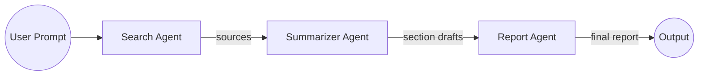

Here’s a clean, production-ready **README.md** you can drop into that repo. I inferred structure and purpose from the repository listing and wrote clear install/usage steps, a mermaid diagram, and contributor notes. If you want me to tailor any bits (e.g., pin to a specific model/provider you’re using), say the word and I’ll edit it.

---

# LangGraph Agent — Research Assistant

A minimal multi-agent workflow built with **LangGraph** for end-to-end research:

1. a **Search Agent** gathers sources,
2. a **Summarizer Agent** condenses findings, and
3. a **Report Agent** assembles a clean, well-structured report.

The project is intentionally small and readable, so you can learn, extend, and adapt it to your stack. Repo layout and filenames below reflect the current codebase. ([GitHub][1])

---

## ✨ Features

* **Multi-agent orchestration** using LangGraph nodes & edges.
* **Search → Summarize → Report** pipeline with clear handoffs.
* **Pluggable tools** (swap search/summarizer models or web tools easily).
* **Deterministic entry points** for CLI and graph execution.

---

## 📂 Project Structure

```
LangGraph-Agent-Research-Assistant/
├─ agents/
│  ├─ search_agent.py         # Finds relevant information
│  ├─ summarizer_agent.py     # Condenses collected info
│  └─ report_agent.py         # Produces a final, structured report
├─ utils/
│  └─ tools.py                # Helper functions / tool wrappers
├─ langgraph_workflow.py      # Graph construction (nodes, edges, state)
├─ main.py                    # CLI entry point / run script
├─ requirementst.txt          # Python dependencies (note the name)
├─ LICENSE
└─ README.md
```

> Note: the dependency file is currently named **`requirementst.txt`** (with a “t”). Either install from that file or rename it to the conventional `requirements.txt`. ([GitHub][1])

---

## 🧠 Architecture



* **Search Agent**: accepts a topic and returns a set of findings (URLs/snippets/notes).
* **Summarizer Agent**: turns the raw findings into concise, faithful summaries.
* **Report Agent**: stitches summaries into a cohesive multi-section report (intro, body, references, etc.).

---

## 🚀 Quickstart

### 1) Clone

```bash
git clone https://github.com/AdityaTak77/LangGraph-Agent-Research-Assistant.git
cd LangGraph-Agent-Research-Assistant
```

### 2) Create & activate a virtual environment (recommended)

```bash
python -m venv .venv
# Windows
. .venv/Scripts/activate
# macOS/Linux
source .venv/bin/activate
```

### 3) Install dependencies

```bash
# Either install using the current filename…
pip install -r requirementst.txt

# …or rename first (optional but conventional):
# mv requirementst.txt requirements.txt
# pip install -r requirements.txt
```

### 4) Configure environment

Set the LLM/search credentials your agents need. Common patterns:

```bash
# Example for OpenAI (adjust to your provider of choice)
export OPENAI_API_KEY="sk-..."

# If you’re using a web search tool, e.g., Tavily/Serper/etc.:
export TAVILY_API_KEY="..."
export SERPER_API_KEY="..."
```

> The exact variables depend on how you wire models/tools inside `agents/*.py` and `utils/tools.py`. If you tell me your provider(s), I’ll prefill these for you.

### 5) Run

```bash
# Typical usage—run the pipeline end-to-end:
python main.py --topic "Impacts of edge AI on on-device privacy" --max-sources 6 --style "concise"
```

**Common flags (suggested):**

* `--topic` — your research topic or question.
* `--max-sources` — how many items the search agent should collect.
* `--style` — report style (e.g., “concise”, “detailed”, “executive”).
* `--out` — optional output file (e.g., `report.md`).

> If your `main.py` signature differs, keep the spirit of these flags and adjust names accordingly.

---

## ⚙️ Configuration & Extensibility

* **Swap models**: Point `Summarizer/Report Agent` to any model/provider you prefer (OpenAI, Anthropic, Groq, local, etc.). The only requirement is a `str -> str` summarize/compose interface.
* **Change search**: Replace the search tool in `utils/tools.py` (or within `search_agent.py`) with your choice: Tavily, Serper, Google Custom Search, Bing, or mocked data for offline testing.
* **Add agents**: Common additions:

  * **Verifier/Fact-Checker** between Summarizer and Report
  * **Citations Normalizer** to unify formats (APA/MLA/IEEE)
  * **Planner** to propose sub-questions before searching
* **Return formats**: Emit Markdown (default), HTML, or JSON sections for downstream pipelines.

---

## 🧪 Example

```bash
python main.py \
  --topic "How LLM-driven agents use cyclic graphs (LangGraph) for research workflows" \
  --max-sources 5 \
  --style detailed \
  --out report.md
```

**Expected output** (excerpt in Markdown):

```markdown
# Research Report: LLM-driven Research with LangGraph

## Executive Summary
…one-paragraph overview…

## Key Findings
- Finding 1 with source
- Finding 2 with source
…

## Discussion
…well-structured analysis…

## References
1. https://example.com/…
2. https://example.org/…
```

---

## 🧩 How it Works (High Level)

* `langgraph_workflow.py` builds a graph with:

  * **Nodes**: `search_agent`, `summarizer_agent`, `report_agent`
  * **Edges**: `UserInput → Search → Summarize → Report`
  * **State**: topic, sources, summaries, final_report

* `main.py` parses CLI args, initializes the graph, and runs it to completion, printing (and optionally saving) the report. ([GitHub][1])

---

## 🔐 Environment Variables (suggested)

| Variable            | Purpose                         |
| ------------------- | ------------------------------- |
| `OPENAI_API_KEY`    | LLM provider (if using OpenAI)  |
| `ANTHROPIC_API_KEY` | Alternative provider (optional) |
| `GROQ_API_KEY`      | Alternative provider (optional) |
| `TAVILY_API_KEY`    | Web search (optional)           |
| `SERPER_API_KEY`    | Web search (optional)           |

> Only set the ones you actually use.

---

## 🛠 Troubleshooting

* **No module named …**
  Ensure your venv is active and dependencies installed from `requirementst.txt`.

* **Empty/low-quality search results**
  Check your search API key and increase `--max-sources`.

* **Hallucinated facts**
  Add a verification step (new agent) or raise the summarizer’s temperature constraints. You can also force the report to output a **References** section with links.

* **Rate limits**
  Batch requests in the search/summarizer steps or enable simple caching in `utils/tools.py`.

---

## 🗺 Roadmap (ideas)

* [ ] Add a **Verifier/Fact-Checker Agent**
* [ ] Add **citation formatting** (APA/MLA/IEEE)
* [ ] Exporters: **PDF/HTML** and **slides**
* [ ] Minimal **web UI** (FastAPI + HTMX or Streamlit)
* [ ] **Config file** for models/tools (YAML/ENV)

---

## 🤝 Contributing

1. Fork the repo
2. Create a feature branch: `git checkout -b feat/my-improvement`
3. Commit changes: `git commit -m "feat: add my improvement"`
4. Push & open a PR

Please keep PRs small and documented.

---

## 📜 License

This project is released under the **MIT License**. See [`LICENSE`](LICENSE). ([GitHub][1])

---

## 🙌 Acknowledgements

* Built on **LangGraph** for robust agent orchestration.
* Thanks to the open-source community for search/tooling packages that plug right in.

---

### Repository reference

* Repo homepage & file listing used to draft this README. ([GitHub][1])

---

[1]: https://github.com/AdityaTak77/LangGraph-Agent-Research-Assistant "GitHub - AdityaTak77/LangGraph-Agent-Research-Assistant: 1. Search Agent – takes the user’s topic and βinds relevant information (can use mock data or simple web search). 2. Summarizer Agent – summarizes the collected information using an LLM. 3. Report Agent – combines all summaries into a well-structured βinal report."
